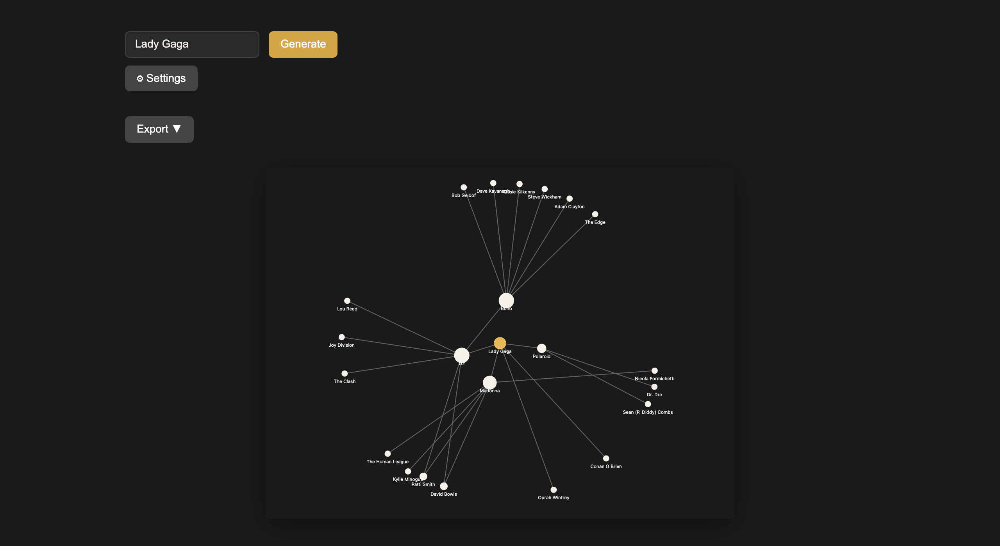
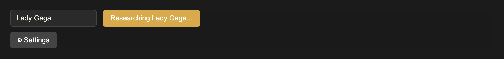

# inspographic

inspographic draws a network diagram of the people and things that influenced anyone you name. Type a name, and it asks [Exa](https://exa.ai) who influenced that person, then who influenced those influences. It draws the result as a force-directed graph that you can export as SVG, PNG, or PDF.



*A test run for Lady Gaga. The subject is the gold node. The large nodes are direct influences (depth 1). The small nodes are influences of those influences (depth 2).*

## How it works

1. You enter a name and click **Generate**.
2. The browser sends the name and your Exa API key to a local Express server (`server/apiProxy.js`).
3. The server asks Exa for the subject and their direct influences. It then asks again for each of the first three direct influences, to get the second level. That is about 4 Exa calls per graph (see [docs/exa-api-costs.md](docs/exa-api-costs.md)).
4. While it works, the server streams the name it is researching back to the browser, and the button shows it:

   

5. The server checks each answer against `schemas/influence-graph.schema.json`, removes nodes that do not connect to the subject, and saves the graph in `server/cache/`. A second request for the same name uses the saved graph and makes no Exa calls.
6. The browser draws the graph with D3.

## Setup

You need Node 18 or later and an Exa API key from <https://dashboard.exa.ai/api-keys>.

```bash
npm install
npm run dev
```

`npm run dev` starts the API server on port 3001 and the Vite dev server on port 3000, then opens <http://localhost:3000>.

Click **Settings** and paste your Exa API key. The app keeps the key in your browser's `localStorage` and sends it only to the local API server.

## Tests

```bash
npm test
```

Tests that touch Exa replay recorded responses from `test/fixtures/vcr/`, so they make no API calls. To record them again with a real key:

```bash
EXA_API_KEY=your_key node scripts/record-vcr.js
```

## Project layout

| Path | Contents |
| --- | --- |
| `src/` | React app: toolbar, settings, export menu, and the D3 graph |
| `server/` | Express API server that calls Exa, validates and caches graphs |
| `schemas/` | JSON schema for an influence graph |
| `test/` | Vitest tests |
| `scripts/` | Scripts to record VCR fixtures and take screenshots |
